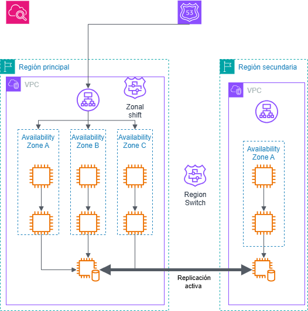

# TFG — Closed-Loop Auto-Recovery on AWS with ARC Zonal Shift

> **Final-degree project (Trabajo de Fin de Grado)** demonstrating a production-grade, self-healing multi-tier web application deployed on AWS and managed entirely with Terraform.



---

## Table of Contents

1. [Overview](#overview)
2. [Architecture](#architecture)
3. [Auto-Recovery System](#auto-recovery-system)
4. [Project Structure](#project-structure)
5. [Prerequisites](#prerequisites)
6. [Deployment](#deployment)
7. [Configuration Reference](#configuration-reference)
8. [Modules](#modules)
9. [Clean-up](#clean-up)

---

## Overview

This project provisions a **three-tier web application** (Web → App → DynamoDB) spanning three AWS Availability Zones, with a **closed-loop auto-recovery mechanism** that automatically detects zonal failures and triggers an [AWS ARC Zonal Shift](https://docs.aws.amazon.com/arc-zonal-shift/latest/api/Welcome.html) to divert traffic away from the impaired AZ — all without human intervention.

Key design goals:

- **High availability** — every tier runs one instance per AZ (3 AZs total).
- **Least privilege** — each component has a scoped IAM role; no wildcard `*` permissions.
- **No hardcoded values** — AMI IDs are resolved at deploy time via AWS SSM Parameter Store.
- **Zero-SNS auto-recovery** — CloudWatch Alarms invoke Lambda directly (no SNS/EventBridge hop).
- **Infrastructure as Code** — every resource is managed by Terraform; nothing is clicked in the console.

---

## Architecture

```
Internet
    │  HTTP :80
    ▼
┌──────────────────────────────────────────────┐
│         Application Load Balancer            │
│   (internet-facing, 3 public subnets)        │
│       ARC Zonal Shift enabled ✓              │
└──────────┬───────────────────────────────────┘
           │  HTTP :80  (target group)
    ┌──────┴──────┐
    │  Web Tier   │  3 × EC2 t3.micro (Amazon Linux 2023)
    │  Apache +   │  one per AZ, private subnets
    │  PHP proxy  │  IAM: SSM only
    └──────┬──────┘
           │  HTTP :8080
    ┌──────┴──────┐
    │  App Tier   │  3 × EC2 t3.micro (Amazon Linux 2023)
    │  Python     │  one per AZ, private subnets
    │  HTTP server│  IAM: SSM + DynamoDB (scoped)
    └──────┬──────┘
           │  AWS SDK
    ┌──────┴──────┐
    │  DynamoDB   │  On-demand, server-side encryption
    │  (sessions) │  Partition key: sessionId
    └─────────────┘
```

Traffic flows: **Client → ALB:80 → Web:80 → App:8080 → DynamoDB**

All EC2 instances live in **private subnets** with no public IPs. Management access is provided exclusively through **AWS Systems Manager Session Manager** (no SSH, no bastion).

---

## Auto-Recovery System

The `auto_recovery` module implements a **closed-loop self-healing loop**:

```
CloudWatch Alarm          Lambda Function              ARC Zonal Shift
(1 per AZ, 5XX spike)  →  zonal_shift_handler.py  →  StartZonalShift(awayFrom=AZ)
                           Python 3.12, 128 MB          Traffic diverted for N minutes
```

### How it works

1. **CloudWatch Alarm** monitors `HTTPCode_Target_5XX_Count` per AZ on the ALB.
2. When the 5XX count exceeds the configured threshold in a 1-minute window, the alarm transitions to `ALARM`.
3. CloudWatch **directly invokes** the Lambda function (no SNS topic, no EventBridge rule).
4. The Lambda reads the `AvailabilityZone` dimension from the alarm payload and calls `arc-zonal-shift:StartZonalShift`, shifting ALB traffic away from the impaired AZ.
5. The zonal shift **auto-expires** after a configurable window (default: 30 minutes). Repeated alarm firings are idempotent.

### Why no SNS?

AWS CloudWatch supports [direct Lambda invocation from alarms](https://docs.aws.amazon.com/AmazonCloudWatch/latest/monitoring/AlarmThatSendsEmail.html) — this removes one hop, reduces latency, and eliminates the need for a separate SNS topic and subscription.

---

## Project Structure

```
TFG/
├── terraform/
│   ├── main.tf                  # Root module — wires all modules together
│   ├── variables.tf             # All input variables with defaults
│   ├── outputs.tf               # Useful outputs (ALB DNS, instance IDs, …)
│   ├── providers.tf             # AWS provider + required versions
│   ├── data.tf                  # Data sources (SSM AMI lookup, …)
│   ├── bootstrap/               # One-time S3/DynamoDB state backend setup
│   └── modules/
│       ├── vpc/                 # VPC, subnets, IGW, route tables
│       ├── security/            # Generic reusable Security Group module
│       ├── iam/                 # IAM roles + instance profiles
│       ├── compute/             # EC2 instances + user_data template
│       ├── alb/                 # ALB, target group, listener
│       ├── dynamodb/            # DynamoDB table
│       └── auto_recovery/       # Closed-loop auto-recovery (Lambda + CW Alarms)
│           ├── main.tf
│           ├── variables.tf
│           ├── outputs.tf
│           └── lambda_src/
│               └── zonal_shift_handler.py
├── tester.py                    # Local test / chaos script
├── Arquitectura-tfg.png         # Architecture diagram
├── .gitignore
└── README.md
```

---

## Prerequisites

| Tool | Version | Notes |
|------|---------|-------|
| [Terraform](https://developer.hashicorp.com/terraform/install) | ≥ 1.6 | |
| [AWS CLI](https://docs.aws.amazon.com/cli/latest/userguide/install-cliv2.html) | ≥ 2.x | Configured with appropriate credentials |
| Python | ≥ 3.12 | Only needed to run `tester.py` locally |
| AWS Account | — | With permissions to create VPC, EC2, ALB, Lambda, IAM, DynamoDB, CloudWatch |

### AWS permissions required

The deploying identity (IAM user or role) needs broad permissions covering: VPC, EC2, ALB, Lambda, IAM (roles/policies), DynamoDB, CloudWatch, SSM, and ARC Zonal Shift.

---

## Deployment

### 1. Configure AWS credentials

```bash
aws configure
# or
export AWS_PROFILE=your-profile
```

### 2. Clone and enter the repo

```bash
git clone https://github.com/Nach29/TFG.git
cd TFG/terraform
```

### 3. Initialise Terraform

```bash
terraform init
```

### 4. Review the plan

```bash
terraform plan
```

### 5. Apply

```bash
terraform apply
```

Terraform will output the ALB DNS name once the apply completes. The application is ready when the ALB health checks turn green (~2–3 minutes after `apply`).

### 6. Access the application

```
http://<alb_dns_name>
```

---

## Configuration Reference

All variables have sensible defaults. Override them via a `terraform.tfvars` file or `-var` flags:

| Variable | Default | Description |
|----------|---------|-------------|
| `aws_region` | `eu-central-1` | AWS region to deploy into |
| `availability_zones` | `["eu-central-1a/b/c"]` | Exactly 3 AZs |
| `vpc_cidr` | `10.0.0.0/16` | VPC CIDR block |
| `web_instance_type` | `t3.micro` | EC2 type for Web tier |
| `app_instance_type` | `t3.micro` | EC2 type for App tier |
| `web_port` | `80` | Web tier listening port |
| `app_port` | `8080` | App tier listening port |
| `alb_health_check_path` | `/health.html` | ALB health check endpoint |
| `dynamodb_table_name` | `…-sessions` | DynamoDB table name |
| `dynamodb_pitr_enabled` | `false` | Enable Point-in-Time Recovery |

### Auto-recovery tuning (in `modules/auto_recovery/variables.tf`)

| Variable | Default | Description |
|----------|---------|-------------|
| `alarm_5xx_threshold` | `10` | 5XX count to trigger a zonal shift |
| `alarm_period_seconds` | `60` | CloudWatch alarm evaluation period |
| `alarm_evaluation_periods` | `1` | Number of periods before alarm fires |
| `zonal_shift_expiry_minutes` | `30` | How long the zonal shift lasts |
| `lambda_log_retention_days` | `7` | CloudWatch Logs retention for Lambda |

---

## Modules

| Module | Purpose |
|--------|---------|
| `vpc` | VPC, 3 public + 3 private subnets, IGW, NAT Gateway, route tables |
| `security` | Generic Security Group with configurable ingress/egress rules |
| `iam` | IAM role + instance profile with managed and inline policies |
| `compute` | EC2 instance with user data templating (Web or App tier) |
| `alb` | Internet-facing ALB, target group, HTTP listener, ARC Zonal Shift enabled |
| `dynamodb` | DynamoDB table with optional PITR and server-side encryption |
| `auto_recovery` | CloudWatch Alarms + Lambda + IAM for closed-loop ARC Zonal Shift automation |

---

## Clean-up

To destroy all resources and avoid ongoing AWS charges:

```bash
cd terraform
terraform destroy
```

> **Note:** DynamoDB tables and CloudWatch Log Groups are destroyed by default. Make sure to back up any data you wish to keep before running `destroy`.

---

## Author

**Ignacio Colas Martin** — EINA, Universidad de Zaragoza  
*Trabajo de Fin de Grado — 2026*
