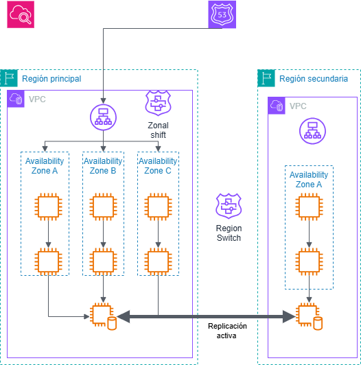

# TFG - Resiliencia cloud en AWS con Terraform

Este repositorio despliega una arquitectura web de tres capas en AWS para demostrar resiliencia zonal y regional con Terraform. La region activa es Frankfurt (`eu-central-1`) y la region de Disaster Recovery es Irlanda (`eu-west-1`) en modo warm standby.



## Objetivo

El objetivo del TFG es demostrar que una plataforma sencilla, reproducible y contenida en costes puede incorporar mecanismos reales de resiliencia:

- Recuperacion automatica ante fallo gris zonal con ARC Zonal Shift.
- Failover regional orquestado con ARC Region Switch.
- DNS global con Route 53 Failover Routing.
- Datos replicados con DynamoDB Global Tables.
- Operacion sin SSH, usando SSM Session Manager.

## Arquitectura

Flujo principal de peticion:

```text
Internet
  -> Route 53
  -> Public ALB
  -> Web ASG privado
  -> Internal ALB
  -> App ASG privado
  -> DynamoDB Global Table
```

Regiones:

- `eu-central-1`: Frankfurt, region activa.
- `eu-west-1`: Irlanda, region warm standby.

Capas:

- Web: Apache/PHP en Auto Scaling Group privado.
- App: servidor HTTP Python en Auto Scaling Group privado.
- Datos: DynamoDB Global Table con replica regional.
- DNS: `dontpushthis.link` con registros `PRIMARY` y `SECONDARY`.

## Resiliencia zonal

La fase zonal usa ARC Zonal Shift sobre el ALB publico de Frankfurt.

El modulo `terraform/modules/auto_recovery` crea:

- Una alarma CloudWatch por Availability Zone.
- Una Lambda Python que recibe la alarma.
- Permisos IAM para iniciar `arc-zonal-shift:StartZonalShift`.
- Un paquete Lambda generado automaticamente con `archive_file`.

Cuando una alarma detecta un pico de `HTTPCode_Target_5XX_Count` en una AZ, la Lambda inicia un Zonal Shift para sacar trafico de esa zona durante una ventana temporal.

Decision importante: los ALB internos tienen `enable_cross_zone_load_balancing = false`. Esto mantiene el aislamiento por zona y permite observar el fallo gris durante la demo.

## Resiliencia regional

La fase regional usa `aws_arcregionswitch_plan` para modelar un failover activo-pasivo entre Frankfurt e Irlanda.

Workflow del plan:

1. Escalar el ASG App de Irlanda.
2. Escalar el ASG Web de Irlanda.
3. Redirigir el trafico DNS con el bloque `Route53HealthCheck`.

El plan usa los records de Route 53:

- `PRIMARY`: Frankfurt, `set_identifier = eu-central-1`.
- `SECONDARY`: Irlanda, `set_identifier = eu-west-1`.

ARC Region Switch genera sus propios health checks para esos records. Terraform los asocia asi:

| Region | Record | Health check ID |
| --- | --- | --- |
| `eu-central-1` | `PRIMARY` | `28bd64da-9556-4ab0-b351-16c25988048b` |
| `eu-west-1` | `SECONDARY` | `aa6f3397-8796-44ce-ad5c-53802612d253` |

Si el plan ARC se borra y se vuelve a crear, estos IDs pueden cambiar. En ese caso hay que actualizar las variables:

- `arc_route53_health_check_id_frankfurt`
- `arc_route53_health_check_id_ireland`

## Estructura

```text
TFG/
|-- README.md
|-- Arquitectura-tfg.png
|-- tester.py
`-- terraform/
    |-- main.tf
    |-- providers.tf
    |-- variables.tf
    |-- data.tf
    |-- outputs.tf
    |-- bootstrap/
    `-- modules/
        |-- alb/
        |-- auto_recovery/
        |-- compute/
        |-- dynamodb/
        |-- iam/
        |-- security/
        `-- vpc/
```

## Requisitos

- Terraform `>= 1.6.0`.
- AWS CLI configurado con credenciales validas.
- Una hosted zone publica existente para `dontpushthis.link`.
- Permisos para VPC, EC2, Auto Scaling, ALB, IAM, Lambda, CloudWatch, Route 53, DynamoDB, SSM y ARC.

## Despliegue

Desde la raiz del repositorio:

```powershell
cd terraform
terraform init
terraform plan
terraform apply
```

Salida principal:

- `domain_name`: URL publicada por Route 53.
- `arc_dr_plan_name`: nombre del plan ARC Region Switch.
- `arc_dr_plan_arn`: ARN del plan ARC Region Switch.
- ARNs y nombres de los ASG principales.

## Verificacion rapida

Comprobar formato:

```powershell
terraform -chdir=terraform fmt -check
```

Validar Terraform:

```powershell
terraform -chdir=terraform validate
```

Si `validate` falla por plugins corruptos o checksums de `.terraform.lock.hcl`, regenera la cache local:

```powershell
terraform -chdir=terraform init
terraform -chdir=terraform validate
```

## Operacion de la demo

Para probar el servicio publicado:

```powershell
curl http://dontpushthis.link
```

Para observar el comportamiento de la fase zonal puedes usar:

```powershell
python tester.py http://dontpushthis.link
```

Para revisar el estado del plan regional, entra en AWS Console:

```text
Route 53 ARC -> Region switch -> tfg-student-icolasma-TFG-dr-plan
```

## Mantenimiento reciente

En la limpieza actual se ha hecho lo siguiente:

- Se han asociado los health checks generados por ARC Region Switch a los records `PRIMARY` y `SECONDARY`.
- Se ha eliminado el health check manual antiguo de Route 53 porque no satisfacia la validacion de ARC Region Switch.
- Se han completado permisos IAM del execution role de ARC para ASG, CloudWatch metrics y Route 53.
- Se han eliminado paquetes `.zip` generados por Terraform y se han anadido al `.gitignore`.
- Se han limpiado comentarios y descripciones con caracteres corruptos.
- Se ha reescrito este README para reflejar solo los archivos y flujos que existen actualmente.

## Notas de coste

El despliegue crea recursos con coste: NAT Gateways, ALBs, EC2, DynamoDB, Lambda, CloudWatch y Route 53. Para evitar cargos cuando no estes usando la demo:

```powershell
cd terraform
terraform destroy
```

## Autor

Ignacio Colas Martin
Trabajo de Fin de Grado, 2026
